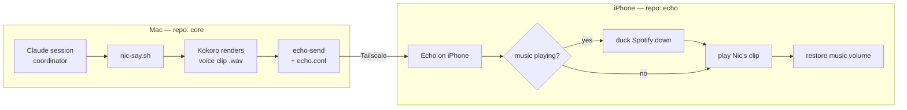

# Echo — architecture & design

> Design-first. This doc is the diagram + the scopes + the decisions.
> **Decisions locked 2026-07-17** are marked ✅.

## 1. The problem, precisely

You run outside with music playing (Spotify, headphones). You also want to hear
Nic's announcements. Today that fails because of how iOS shares sound:

- By default, two apps that both want the audio channel **fight**. One wins and
  the other is paused — that's why launching VLC pauses Spotify.
- What you actually want is **ducking**: an app that briefly turns the music
  *down*, speaks over it, then turns it back *up*. This is a specific setting
  (`AVAudioSession` with the `.duckOthers` option) that navigation and voice-
  prompt apps use. Media players like VLC don't expose it — they're built to be
  the main event, not a voice on top. So a small custom app is the honest path.

## 2. The key insight — Echo is a *player*, not a *talker*

Kokoro (the neural voice) runs on the **Mac**. A phone can't run it. So Echo
never synthesizes speech. The division of labor:

- **Mac** already turns Nic's text into Kokoro audio (`voice/nic-tts.py`). We
  add one thing: when there's something to say, also **send that audio clip to
  the phone**.
- **Echo (phone)** is a **networked player that ducks**: it receives the clip,
  dims your music, plays it, restores the music. That's the whole job.

The transport is **Tailscale** — your Mac and phone are already on the same
private network (that's the `100.x` address the iPad used for the dev server), so
no cloud, no accounts, health/finance audio never leaves your devices.

## 3. Delivery — how the clip reaches the phone ✅

iOS suspends background apps, so an app can't just sit there listening forever.
Options considered: (A) phone runs a listener — dies when backgrounded;
(B) push wakes it — needs a paid Apple Developer account on a free cert;
(C) kept alive by playing silent audio; (D) you open it for the run.

**✅ Decided: open-on-run (D), built on the keep-alive trick (C).** You open Echo
when you head out; it stays live for the session and plays whatever the Mac
sends. No push, no paid account, no always-on infrastructure. Always-on delivery
(Echo speaks without being opened) is an explicit **v2** that adds push (B).

## 4. Scopes (build order)

- **v0 — proof it ducks.** Echo app that, on a button tap, ducks Spotify, plays
  a bundled test clip, restores. Proves the one hard iOS behavior in isolation.
  *(scaffolded — the code in this repo now)*
- **v1 — the real loop.** Mac renders Kokoro audio and sends it over Tailscale
  (`core/voice/echo-send`); Echo receives and plays it ducked, staying alive
  through a locked screen / a run (C). Hook into `nic-say.sh` so the
  coordinator's voice reaches the phone when Echo is connected.
- **v2 — always-on.** Push-triggered delivery so Echo speaks without being
  opened first. Deferred until v1 earns its keep.

## 5. Reproducibility contract (requirement, 2026-07-17)

> *"Clone **core** and **echo**, set them both up, and you get the same working
> system."* This is a hard requirement, held to the same bar as core's
> integrity/backup discipline. Concretely:

- **No personal state in git.** Every value that's *yours* — the Mac's Tailscale
  address, the shared token, signing identity — lives in a **template** you copy
  and fill (`echo.conf.example` → `echo.conf`, gitignored). Same pattern on the
  core side (`core/voice/echo.conf`). A fresh clone has *placeholders*, never
  secrets.
- **The Xcode project is generated, not committed.** We describe the app in a
  small `project.yml` and let **XcodeGen** regenerate an identical
  `Echo.xcodeproj` on any machine (`brew install xcodegen && xcodegen`). No
  fragile hand-edited project file drifting between clones — the spec is the
  source of truth, so everyone gets the same build settings, entitlements, and
  bundle id.
- **Toolchain pinned + documented.** iOS deployment target and the required
  Xcode/tool versions are written down (`.tool-versions` / README), so "it built
  for me" means "it builds for you."
- **The two repos are a matched pair.** Echo (phone) and core's `echo-send`
  (Mac) share one token and one protocol, both documented here and mirrored in
  each repo's setup. Neither works alone; together they reproduce the loop.

## 6. Build & deploy reality (so there are no surprises)

- Echo is a Swift/SwiftUI app built in **Xcode**, sideloaded like Pulso: free
  developer cert, **re-signed every ~7 days** (⌘R). Two apps to re-sign now
  instead of one — you've accepted that.
- I can write all the code — the Swift app, the Mac-side sender, the repo, the
  docs. **Building, signing, and running it needs your hands in Xcode**, exactly
  like Pulso's cycle. I can't compile or sign an iOS app from here.
- ✅ Open-source repo under your GitHub account, **public**, named **`echo`**,
  MIT license.

## 7. Open questions

1. ✅ Delivery model — open-on-run.
2. ✅ Repo — public, named `echo`.
3. Partly answered — see §8: he started naming the richer surface (history,
   transport controls, tags, decision/action surfacing).

## 8. v2 — the listening surface (his feature ideas, 2026-07-17)

From using v1, Rannyeri wants Echo to become a richer *listening surface*, not
just a fire-and-forget player. Captured for design; **not yet built** — build
order when greenlit: history list → now-playing widget → tags → (maybe) actions.

- **Audio history — one item per clip.** A list where each received audio is its
  own row, clearly one audio. *Feasible.* The concern "we delete the files
  quickly" is about the **server outbox** (deleted right after sending); the
  **phone keeps what it received** — we retain the last N clips (display text +
  the audio file) so they list and replay even after playing.
- **Now-playing widget + transport.** While a clip plays: **pause · stop ·
  restart (back to start)** and a **progress bar** at the bottom showing
  position. *Feasible* — `AVAudioPlayer` exposes `play/pause/currentTime/duration`
  and a SwiftUI scrubber binds to it. **First v2 build candidate.**
- **Context tags per clip.** Small chips so he knows what a clip is about before
  playing (MVP / personal / system / …). *Feasible* — the Mac sends a tag with
  each clip (an `X-Echo-Tag` header set by the coordinator / echo_push); the app
  renders it as a chip. Needs the Mac side to classify/label clips.
- **Actionable / decision surfacing.** If a clip carries a decision (A vs B) or an
  action for him, show it on the row as tappable options. *Exploratory* — he's
  unsure yet. Needs structured metadata from the Mac (a decision/action payload
  alongside the audio) and is the first real step toward **two-way** — where
  voice hands off to on-screen interaction — so design it deliberately, not by
  accident.
