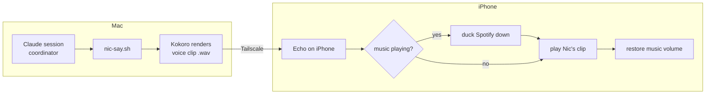

# Echo — architecture & design

> Design-first. This doc is the diagram + the scopes + the one decision that's
> yours. Code comes after you've seen the shape.

## 1. The problem, precisely

You run outside with music playing (Spotify, headphones). You also want to hear
Nic's announcements. Today that fails because of how iOS shares sound:

- By default, two apps that both want the audio channel **fight**. One wins and
  the other is paused — that's why launching VLC pauses Spotify.
- What you actually want is **ducking**: an app that briefly turns the music
  *down*, speaks over it, then turns it back *up*. This is a specific setting
  (`AVAudioSession` with the `.duckOthers` option) that navigation and voice-
  prompt apps use. Media players like VLC don't expose it — they're built to be
  the main event, not a voice on top. So a small custom app is the honest path.

## 2. The key insight — Echo is a *player*, not a *talker*

Kokoro (the neural voice) runs on the **Mac**. A phone can't run it. So Echo
never synthesizes speech. The division of labor:

- **Mac** already turns Nic's text into Kokoro audio (`voice/nic-tts.py`). We
  add one thing: when there's something to say, also **send that audio clip to
  the phone**.
- **Echo (phone)** is a **networked player that ducks**: it receives the clip,
  dims your music, plays it, restores the music. That's the whole job.

The transport is **Tailscale** — your Mac and phone are already on the same
private network (that's the `100.x` address the iPad used for the dev server), so
no cloud, no accounts, health/finance audio never leaves your devices.

## 3. THE decision that's yours — how the clip reaches the phone

iOS is strict about background apps: a backgrounded app normally gets suspended,
so it can't just sit there listening forever. Four ways to deal with that:

| Option | How it works | Cost |
|---|---|---|
| **A. Phone listens** | Echo runs a mini web server; Mac POSTs clips | iOS suspends it when backgrounded → unreliable while your phone's in your pocket |
| **B. Push wakes it** | Mac sends a push; iOS wakes Echo to fetch + play | Push on a *free* sideload cert is painful — usually needs a paid Apple Developer account |
| **C. Kept alive by audio** | Echo plays silent audio to stay awake, holds a live link to the Mac | Small battery cost; slightly hacky — but fine for a sideloaded app |
| **D. You open it for the run** | You launch Echo when you head out; it stays live (via C) for the session; you close it after | Requires the one deliberate tap — matches how you actually use it |

**My recommendation: D built on C.** You already *decide* to go for a run, so
opening Echo at the start is natural — no always-on infrastructure, no paid
account, no push plumbing. Echo keeps itself alive with the background-audio
trick for the length of the run and plays whatever the Mac sends. If you later
want it always-on (announcements even when you didn't open it), that's a **v2**
that adds push (Option B) — a real feature, but not needed to get you running
this week.

*Your call:* is "open Echo when I head out" acceptable as the model, or do you
want always-on from day one (accepting the push/paid-account detour)?

## 4. Scopes (build order)

- **v0 — proof it ducks.** Echo app that, on a button tap, ducks Spotify, plays
  a bundled test clip, restores. Proves the one hard iOS behavior in isolation.
- **v1 — the real loop.** Mac renders Kokoro audio to a file and sends it over
  Tailscale; Echo receives and plays it ducked, staying alive through a locked
  screen / a run (Option C). Hook into `nic-say.sh` so the coordinator's voice
  goes to the phone when Echo is connected.
- **v2 — always-on.** Push-triggered delivery so Echo speaks without being
  opened first. Deferred until v1 earns its keep.

## 5. Build & deploy reality (so there are no surprises)

- Echo is a Swift/SwiftUI app built in **Xcode**, sideloaded like Pulso: free
  developer cert, **re-signed every ~7 days** (⌘R). Two apps to re-sign now
  instead of one — you've accepted that.
- I can write all the code — the Swift app, the Mac-side sender, the repo, the
  docs. **Building, signing, and running it needs your hands in Xcode**, exactly
  like Pulso's cycle. I can't compile or sign an iOS app from here.
- Open-source repo under your GitHub account (like the way Pulso is its own
  thing), MIT-style license unless you prefer otherwise.

## 6. Open questions for you

1. Delivery model: **open-on-run (D)** — recommended — or always-on from day one?
2. Repo: **public** (open-source, as you said) and named **`echo`** — confirm?
3. Anything beyond voice you want Echo to hold "in the future" (you hinted it
   might carry *all* communication features)? Naming that now shapes v1's seams.
