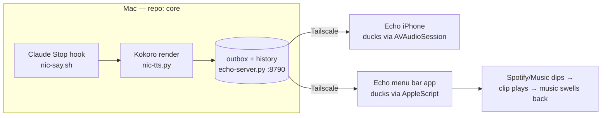

# Echo Desktop — the menu bar app (design)

> Design-first: diagram → options → recommendation → v0 scope.
> **Reframe 2026-08-20** (branch `feature/echo-streaming`): EchoMac left the
> menu bar — it's a regular, freely positioned window now (Dock icon, ⌘Tab,
> unplayed count on the Dock badge). The §1/§2 MenuBarExtra shape below is
> history: Echo is growing from clip player into the voice interface to the
> Claude CLI, and an interface earns a window. Everything else (ducking
> engine, server lifecycle, shared views) stands.
> **Status: v0 BUILT 2026-07-25** (branch `feature/echomac-v0`) — shape as
> designed in §2/§5, with the spike's amendment applied: the **process-tap
> engine is the primary duck**, AppleScript demoted to a selectable fallback
> (Settings → Ducking). Still pending: the core-side `MAC_PLAYER` knob (§4 —
> until it lands the Mac double-speaks via afplay), login item (v0.1),
> `DELIVERY` suppression. Server-surface reality check: the iOS v1 lane
> shipped **no** history endpoint, so EchoMac reads the same destructive
> `/next` — each clip is delivered to exactly one listening player, not both
> (§5's "steal" risk resolved by accepting single-delivery for v0).
> Original proposal below, kept verbatim.

## 1. The UX target

In his words: the Echo experience on the Mac — *"hanging on the nav bar of the
Mac so it's always accessible, always visible… it opens this small window from
the top bar… the same UI, the same interface, but in just a small box coming
from the top bar."*

Concretely:

- An **Echo icon in the menu bar** (the strip at the top of the Mac screen,
  next to the Wi-Fi and battery icons). Click it → a small panel drops down.
- The panel shows **the same list the iPhone shows**: today's clips, a
  **lane/label chip** per row so he knows what a message is about before
  playing, **played = grayed**, **new = dot**.
- While he works with music playing on the Mac, an arriving message **ducks**
  the music (turns it down, not off), Nic speaks, the music swells back —
  the exact behavior Echo already gives him on the run, now at the desk.



One render, one queue, two players — same port, same token, same clip format.
Nothing new to operate. Both reach the server over Tailscale: since 2026-08-08
`echo-server.py` binds to the Mac's tailnet IP only (off the LAN), so the
menu-bar app's `127.0.0.1` default no longer resolves — set **Host** in its
settings to the Mac's Tailscale IPv4 (`tailscale ip -4`), same as the phone.

## 2. The shape — a macOS target in the same project, sharing the list UI

### The two concepts this rests on

**MenuBarExtra** is a built-in SwiftUI component (macOS 13+): you declare
`MenuBarExtra("Echo", systemImage: "waveform") { ClipListView() }` with
`.menuBarExtraStyle(.window)` and macOS gives you exactly the thing he
described — a persistent top-bar icon that opens a small floating panel
containing any SwiftUI view. No window management code; the "small box coming
from the top bar" is one modifier.

**A target** is one buildable product inside an Xcode project. Today
`project.yml` declares one target (`Echo`, platform iOS). We add a second
(`EchoMac`, platform macOS) in the *same* file. Both targets compile the same
shared Swift files — the clip model, the server client, the list rows — plus a
small platform-specific folder each. One repo, one `xcodegen` run, two apps.

### What's reusable today (file by file)

| File | Reusable on macOS? |
|---|---|
| `EchoClient.swift` | **Almost entirely.** Pure Foundation networking (URLSession, UserDefaults) — all cross-platform. Only its `AudioDucker` reference is iOS-bound; put a tiny `Player` protocol between them and each platform plugs in its own. |
| `ContentView.swift` | **The list rows, yes** — the part that matters. The chrome (NavigationStack, sheet, "Start listening" button) is phone-shaped; the menu bar panel gets its own thin wrapper around the same row view. |
| `SettingsView.swift` | **Mostly** — `keyboardType`/autocapitalization are iOS-only, fenced with `#if os(iOS)`. On the Mac, host is just `127.0.0.1`, so settings shrink to the token. |
| `AudioDucker.swift` | **No.** It's built on `AVAudioSession`, which does not exist on macOS (see §3). This is the one genuinely platform-specific piece. |
| `EchoApp.swift` | No (10 lines) — macOS gets its own entry point with `MenuBarExtra`. |

Proposed layout (the only structural change to the repo):

```
Sources/
  Shared/   Clip, EchoClient, ClipRowView, ClipListView   ← both targets
  iOS/      EchoApp, AudioDucker, iOS settings chrome     ← iPhone only
  macOS/    EchoMacApp (MenuBarExtra), MacDucker          ← Mac only
```

In `project.yml`, `EchoMac` gets `LSUIElement: true` — an Info.plist flag
meaning "menu bar accessory, no Dock icon, no ⌘Tab entry." Always visible up
top, never in the way.

### Alternatives, briefly

- **Separate native app (own repo/project):** the list UI forks immediately —
  when v1's tags/history land on iOS, someone re-implements them for the Mac.
  Two UIs drifting is exactly the maintenance weight Nic exists to absorb.
- **Electron:** a ~200 MB browser runtime plus a Node toolchain to show a
  popover list — a second ecosystem to keep reproducible, and it still has to
  shell out to AppleScript for ducking. All cost, no advantage.
- **Python menu bar tool (rumps + py2app):** quickest hack, but zero reuse of
  the SwiftUI rows, a packaging step that breaks between machines, and a
  second UI to maintain forever.

**Native + shared target wins on the reproducibility contract** (§5 of
`architecture.md`): *clone core + echo, run `xcodegen`, get the same system* —
now including the desktop half, from the same spec file. Bonus over the
iPhone: **no 7-day re-sign treadmill.** That treadmill is an iOS free-cert
provisioning rule; a macOS app signed to run locally just keeps running.
Build once, forget it.

## 3. Ducking on macOS — the hard part

On iOS, ducking is a system service: apps declare intent through
`AVAudioSession` (`.duckOthers`) and iOS mixes everyone accordingly — that's
the one hard behavior Echo v0 proved. **macOS has no equivalent.** There is no
system audio session, no `.duckOthers`; every app controls only its own
volume. So the Mac app must *make* ducking happen. The honest options:

**(a) AppleScript volume automation on known players — recommended.**
Spotify and Apple Music are both scriptable: they expose a `sound volume`
property (0–100) any app can set. The duck becomes: read the player's current
volume → dip it (e.g. to ~20% over a couple of quick steps so it's a dip, not
a cliff) → play the clip through `AVAudioPlayer` (which works fine on macOS)
→ restore the saved volume. Simple, precise, only touches the music.
*Cost:* it's per-app — we wire the players he actually uses; audio from a
browser tab is invisible to it. And it needs one-time permission (below).

**(b) System output volume dip — the universal fallback.** Dip the Mac's
master volume itself. Works on any sound source, no permission needed. But
it's crude: it also ducks a video call or a YouTube tab — and it ducks
**Echo's own clip too** (everything goes through the same output), so the
clip must be pre-boosted to compensate and the effect is "everything gets
quieter, Nic slightly less so." Fine as a toggle for non-Spotify days, wrong
as the default.

**(c) Core Audio process taps — the pro answer, over budget.** Since macOS
14.4 an app can tap and process another app's audio stream (what audio-mixer
utilities like SoundSource are built on). True per-process ducking of
anything — and a rabbit hole of low-level Core Audio far beyond a lane-day.
Out; noted so we know where the ceiling is if it's ever wanted.

**Recommendation: (a) for Spotify + Music, with (b) as a settings toggle.**

**The permission moment he'll see:** the first time Echo Mac ducks Spotify,
macOS shows a one-time dialog — *"Echo wants to control Spotify"* (this is
TCC, the same consent system behind camera/mic prompts, applied to one app
scripting another; the app declares why via `NSAppleEventsUsageDescription`).
Click **OK** once per player and it's remembered. Click **Don't Allow** and
ducking silently fails — fixable later in System Settings → Privacy &
Security → Automation. Design around it: Settings gets a "Test duck" button
so the prompt fires while he's watching, not mid-first-message (§5 gotchas).

## 4. The real design decision — who speaks on the Mac?

Today `nic-tts.py` does two things with the coordinator's audio: **plays it
directly** through `afplay` (Mac speakers, no ducking — music and Nic talk
over each other) and, when the delivery server is up, **queues the clip** for
the phone. Add a Mac player app without touching that, and the Mac speaks
twice. So the decision:

| | How it works | Trade-off |
|---|---|---|
| **A — the app becomes THE Mac player** | The hook only renders + enqueues; the menu bar app plays everything, ducked | One player, one history, one played-state, one mute. Mac is silent if the app isn't running. |
| **B — app is a viewer/replayer only** | `nic-play`/afplay keeps speaking un-ducked; the app just lists and replays | Double-audio risk, no ducking on live messages (the whole point), split state — the list says "played" about audio the list didn't play. |
| **C — app plays, direct path auto-falls back** | `nic-tts` detects whether the app is running and speaks directly if not | Split brain: sometimes ducked, sometimes not, and "why did that one blast over my music?" becomes a recurring debugging session. |

**Recommendation: A**, with the old path kept one config flip away rather
than as an automatic fallback. A new knob in `voice.conf`:

```
MAC_PLAYER=app     # app = menu bar app plays (ducked) · direct = today's afplay path
```

`nic-tts.py` reads it: `app` → skip afplay, enqueue only; `direct` → exactly
today's behavior. Rollback is editing one line, not code. The "app isn't
running" case is solved the way C hints at but simpler: make the app a
**login item** (auto-starts at login) once v0 proves out — until then, opening
it in the morning is the same deliberate gesture as opening phone Echo before
a run.

**Known trade-off to accept in v0:** the hook currently streams — first audio
in ~2–4s because chunks play as they're synthesized — but the outbox gets one
concatenated clip only *after* the last chunk renders. Played through the
app, a long reply's audio starts later than today (up to tens of seconds on
very long ones; typical announcements are short and won't feel it). If it
grates, the v1 fix is known: push per-chunk clips with a group id and let the
app play them gaplessly. Not v0.

**Double delivery with the iPhone** (he's at the desk, both players
listening): keep v0 dumb — **every player that is listening plays what
arrives.** Phone Echo is open-on-run: he opens it when leaving, so desk-time
overlap only happens when he's left it listening deliberately — the fix is
closing it, not code. For later, reserve a knob in `echo.conf`
(`DELIVERY=both|desktop-first`, where desktop-first means the server skips
auto-play delivery to the phone while the Mac app is alive and fetching) —
documented now so the name is agreed, built only if both-play actually
annoys him in practice.

## 5. v0 scope — smallest thing worth building (≤ a lane-day)

**In:**

- `Sources/{Shared,iOS,macOS}` split + `EchoMac` target in `project.yml`
  (macOS 13+, `LSUIElement: true`).
- Menu bar icon + `.window`-style panel rendering the **same row view as
  iOS**: today's clips, lane/label chip, played = grayed, new = dot on the
  row and on the menu bar icon.
- `MacDucker`: AppleScript dip/restore for **Spotify and Music** (skip
  players that aren't running — never launch one), clip playback via
  `AVAudioPlayer`, system-volume dip as a settings toggle fallback.
- Reads the **same server/manifest the iOS v1 lane ships**, on
  `127.0.0.1:8790` with the same token — shared `EchoClient`, zero new
  server surface for desktop.
- `MAC_PLAYER=app|direct` knob in `voice.conf`, honored by `nic-tts.py`
  (skip afplay when `app`).
- Settings: token field + "Test duck" button (fires the TCC prompt on
  purpose).

**Out (explicitly):** per-app mixing beyond the volume dip, Core Audio taps,
waveforms, search, transport/scrubbing, browser-audio detection, the
`DELIVERY` knob, login item (v0.1: `SMAppService.mainApp.register()`, ~5
lines, add once v0 has earned it).

**Risks & gotchas:**

- **Server shape is the v1 lane's.** Today's `/next` is destructive — the
  server deletes a clip once one client fetches it, so a second player would
  *steal* clips from the phone. The desktop app therefore depends on the v1
  lane's history/manifest surface (24h retention + metadata sidecar) and must
  read *that*, never `/next`. Sequence the lanes: **desktop lands after v1**,
  rebased on its server and `EchoClient` changes.
- **Same-files collision.** The v1 lane is editing all five sources; the
  `Shared/` split is the one structural change that conflicts. Do the split
  as the desktop lane's first commit after v1 merges (or hand the split to
  the v1 lane).
- **App Nap:** macOS throttles apps it thinks are idle — a hidden menu bar
  app qualifies, which can slow the poll loop. `EchoClient`'s
  `waitsForConnectivity` session absorbs most of it; belt-and-braces is one
  line (`ProcessInfo.beginActivity`) while listening.
- **TCC automation prompt:** if it first appears mid-message (or worse, while
  he's away and it times out), ducking "mysteriously" fails. Hence the Test
  duck button in Settings; also: don't sandbox the app (a sandboxed app needs
  an extra entitlement to send AppleScript — needless friction for a
  personal, locally signed app).
- **XcodeGen multiplatform pitfalls:** keep **two explicit targets** (skip
  the fancier single-target `supportedDestinations` mode — two targets diff
  cleaner and fail clearer); each target needs its own generated Info.plist
  properties (the iOS background-audio and local-network keys must *not*
  leak into the Mac target); any `AVAudioSession` code must live under
  `iOS/` or `#if os(iOS)` or the Mac target won't compile.

## 6. Recommendation & open questions

**Recommendation:** build Echo Desktop as a SwiftUI `MenuBarExtra` target
inside the existing XcodeGen project, sharing `Clip`/`EchoClient`/row views
with iOS; duck via AppleScript volume automation on Spotify/Music with a
system-volume-dip fallback toggle; and make it **the** Mac player (option A)
— the Stop hook renders and enqueues, the app plays everything ducked, with
`MAC_PLAYER=direct` in `voice.conf` as the one-line rollback. Land it after
the iOS v1 lane so it reads the same history/manifest on localhost.

**Open questions (only ones that change the build):**

1. **Both-play at the desk:** is "close phone Echo when you sit down"
   acceptable for v0, or is `DELIVERY=desktop-first` suppression a day-one
   requirement? (The latter adds server work — roughly half a lane-day.)
2. **Silent-Mac tolerance:** with option A, if the menu bar app isn't
   running, the Mac doesn't speak (rollback = flip `MAC_PLAYER=direct`). OK
   until the login item lands in v0.1, or must `nic-tts` auto-detect a dead
   app and speak directly (that's option C's split brain — recommend no)?
3. **What actually plays your desk music?** If it's Spotify (and sometimes
   Music), plan (a) covers you. If YouTube/browser audio is a real share of
   desk listening, the system-volume dip becomes the main path, not the
   fallback — worth knowing before wiring the duck order.

---

## Spike results 2026-07-21 — Core Audio process taps ARE the ducking engine

> Feasibility spike, sanctioned after Baptist confirmed browser/YouTube audio is
> a real share of desk listening (§6 Q3). Code: `spikes/proc-tap-ducker/`
> (SwiftPM CLI `duckctl`, ~590 lines incl. instrumentation; measurement CSVs in
> `spikes/proc-tap-ducker/results/`). Tested live on this Mac — macOS 26.6,
> Apple Silicon, Swift 6.2.3, CLT-only toolchain.

**Verdict: FEASIBLE — and it should replace §3(a) as the primary duck path.**
§3(c) called taps "over budget"; that was wrong at today's API surface. True
per-app ducking of *anything* (Spotify AND a Chrome YouTube tab, measured) is
~350 lines of userspace Swift: no kernel driver, no virtual device, no special
entitlements — one TCC grant. The BackgroundMusic-driver fallback was not
needed and is dead.

### How it works (the 5-line version)

`CATapDescription` on the target's HAL process objects with
`muteBehavior = .mutedWhenTapped` → `AudioHardwareCreateProcessTap` → wrap the
tap + the default output device in a *private* aggregate device → run an IOProc
that reads the tapped audio and writes it back to the output at `gain`. While
the tap is being read, macOS silences the app's own path — the IOProc *is* the
app's speaker path, at whatever gain we choose. Stop reading → the app's own
path resumes. Duck = ramp gain 1.0→0.2; release = ramp back and tear down.

### Measurements (all runs: 48 kHz stereo float, 512-frame / 10.7 ms IO cycles)

| Metric | Measured |
|---|---|
| Engage, cold (cmd start → we own the app's audio path) | **134 ms** Spotify / 383 ms Chrome (incl. ~0.3 s process-enumeration + logging; tap create 3–6 ms, aggregate create 11–38 ms, IOProc install 2–16 ms, first callback ≤ ~20 ms after start) |
| Engage, warm (tap held, change gain only) | one IO cycle, **~11 ms** |
| Duck ramp (1.0 → 0.2, linear, per-frame) | 60 ms by design, measured 59–63 ms |
| Release ramp + full teardown | 55–64 ms + 26–28 ms |
| Audio continuity | **0 callback gaps** in every run (504 / 599 / 412 callbacks); captured RMS steady across engage→duck→release (0.0106 → 0.0119 → same) — capture never drops, duck is purely output gain |
| CPU while actively re-rendering | **0.0–0.1 %** |
| Crash mid-duck (`kill -9` the tap holder) | **No stuck mute.** Spotify's playhead advanced continuously through engage→kill→after (36.1 s → 44.4 s → 50.9 s) and a concurrent meter shows uninterrupted audio across the kill boundary. By API contract the mute lasts only "for the duration of the read activity"; the HAL destroys a dead client's tap + aggregate. |

### The Chrome-helper problem dissolved

Feared: hunting the right audio helper among ~50 Chrome processes. Reality:
only **3** Chrome processes register with the audio HAL (browser + 2 helpers);
renderers never appear. Audio is brokered through one audio-service helper
(`com.google.Chrome.helper`, the only one with `IsRunningOutput = true`).
Strategy that works: tap **every** HAL process object whose bundle ID matches
the app — no helper hunting, and a single `CATapDescription` takes the whole
array.

### TCC — what was (and wasn't) observed

- **No prompt fired on this machine.** The unsandboxed run captured real audio
  immediately — an audio-capture grant already existed for the shell's
  responsible process (TCC.db is FDA-protected, couldn't name the holder). So
  the exact prompt text remains unobserved; expected for EchoMac: one-time
  *"EchoMac would like to record this computer's audio"* under Privacy &
  Security → **Screen & System Audio Recording** (app must carry
  `NSAudioCaptureUsageDescription`).
- **Denial is SILENT — design for it.** Under Claude's seatbelt sandbox (the
  equivalent of an unauthorized caller) every API call returns `noErr`, the
  engine runs perfectly… and the tap delivers dithered near-silence (~-80 dB,
  RMS ~8e-5) plus a one-time ~2.1 s stall installing the IOProc. No error code
  anywhere. The §5 "Test duck" button must therefore *measure captured RMS*:
  below ~1e-5 while music plays ⇒ tell him to grant the permission (and fall
  back to AppleScript meanwhile). Corollary for Nic: `duckctl` only works from
  an unsandboxed shell.

### Engine quirks to build around (found the hard way)

1. **Silent target = zero IO callbacks.** The tap-fed aggregate idles until the
   tapped app actually produces audio (a paused Spotify gave 0 callbacks in
   3 s). Don't gate on "first callback"; set the gain state and let callbacks
   start whenever audio does. Semantically fine for ducking — nothing audible
   means nothing to duck.
2. **Taps see PRE-mute audio.** A concurrent global tap metered the ducked app
   at full level — capture reflects what apps *produce*, not what reaches the
   speaker. Means: multiple tap holders coexist peacefully (Rogue Amoeba's
   `arkaudiod` was live on this Mac throughout, zero interference), but a tap
   can't *verify* delivery-level ducking.
3. **Private taps are invisible cross-process** (`kAudioHardwarePropertyTapList`
   → 0 from another process) — fine, but don't build diagnostics on that list.
4. **Sequence the seams at unity gain:** engage passthrough at 1.0, settle
   ~100 ms, then ramp down; ramp up fully before teardown. Both path-handoff
   seams then happen at identical levels — no measured discontinuity.

### Recommended v0 ducking architecture for EchoMac

| | Process-tap engine | AppleScript volume (§3a) | System-volume dip (§3b) |
|---|---|---|---|
| Covers | **Anything audible** (Spotify, Music, Chrome/YT, calls…) | Spotify + Music only | everything incl. Echo's own clip |
| Permission | 1× System Audio Recording | 1× Automation *per player* | none |
| Duck quality | per-frame ramp, gain exact | stepped volume, per-app | crude, global |
| Failure mode | silent capture if denied (detectable via RMS) | silently fails if denied | — |
| Role in v0 | **primary** | fallback when tap TCC denied | drop |

- `MacDucker` = spike's `TapEngine` behind the §2 `Player` protocol. On clip
  arrival: enumerate HAL process objects, tap everything currently
  `IsRunningOutput` **except Echo itself**, ramp to 0.2, play the clip via
  `AVAudioPlayer`, ramp back, tear down. That is iOS `.duckOthers` semantics,
  rebuilt — same behavior on both Echo platforms, browser audio included.
  (Alternative: one `initStereoGlobalTapButExcludeProcesses([self])` tap ducks
  present *and future* audio sources in one object — API supports it; whether
  processes that start mid-duck join dynamically is untested.)
- Keep taps **duck-scoped** (create on engage, destroy on release, ~50 ms
  overhead): avoids holding a standing capture object, and minimizes exposure
  to the (unverified) system recording-indicator question.
- Untested edges for the build lane: default-output-device switch mid-duck
  (aggregate wraps a device UID — rebuild on `kAudioHardwarePropertyDefaultOutputDevice`
  change), recording-indicator visibility while a tap is live, dynamic-join on
  global taps, and one 30-second ear check for seam clicks (engage/release
  measured gapless at unity gain; speaker-side click can't be measured without
  a loopback driver).

**Effort to productionize: 1–2 lane-days.** Day 1: port `TapEngine` into
`Sources/macOS/MacDucker`, TCC onboarding (Test-duck button + silent-denial RMS
check + AppleScript fallback wiring). Day 2 (buffer): device-switch rebuild,
duck-while-silent handling, ramp tuning by ear. The §3 AppleScript design
survives as the fallback module, not the default.

**Spike code:** `spikes/proc-tap-ducker/` — `swift build -c release`, then
`duckctl list | taps | duck --app spotify --gain 0.2 --seconds 5 | meter`.
Untracked, no repo state touched; promote or delete at will.

## Server lifecycle 2026-08-14 — the app owns the delivery server

Learned the hard way (the zombie-audio morning): after the 2026-08-13 reboot
nothing was listening on :8790 — echo-server.py is started by hand and no one
restarts it — while the login agent dutifully relaunched the *client*. Every
announcement then took nic-tts.py's direct fallback: afplay on the Mac, no
ducking, nothing to the phone. Quitting EchoMac changed nothing, because the
voice was never coming from EchoMac. The system's two halves had opposite
lifecycles: client at login, server at hand-start — and a reboot splits them.

`ServerController` closes that split:

- **Launch ensures the server.** If nothing accepts on loopback:8790 (the
  server always binds loopback, echo.conf 2026-08-08), the app runs
  `echo-send.sh start` (path overridable via `serverScript` in UserDefaults).
  Login now brings up the whole chain: agent → app → server → phone + ducked
  Mac playback.
- **Quit stops the server — if the app started it.** Panel power button →
  `applicationWillTerminate` → `echo-send.sh stop`. "Quit the app" finally
  means "Echo is silent", matching the intuition the incident violated.
- **A hand-started server is external and untouched.** Phone-only delivery
  (server up, no app) stays possible exactly as before — start it by hand,
  and the app won't tear it down on quit.
- Force-quit skips `applicationWillTerminate`; `echo-send.sh stop` remains the
  manual override for that case.

Corollary that stays true: the login agent must launch a **current** build.
The 2026-08-14 incident was compounded by the agent pointing at a Jul 25
Debug build — three weeks older than come-up-listening. After changing the
Mac app, rebuild (or better: put a Release copy in /Applications and re-run
`scripts/echomac-login.sh install`).
